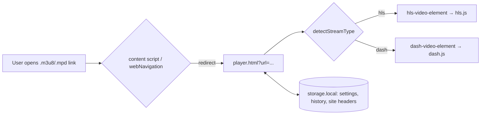

# Architecture

```
src/
├── manifest.ts          # buildManifest(browser, version) → manifest.json per target
├── background/
│   ├── index.ts         # service worker / event page: redirects, play requests, header rules
│   └── detect.ts        # opt-in stream detection (webRequest) kept in storage.session per tab
├── content/index.ts     # intercepts clicks on .m3u8/.mpd links
├── lib/                 # shared, framework-free modules (unit-tested)
│   ├── browser.ts       # `ext` = browser ?? chrome
│   ├── detected.ts      # detected streams, replayable headers, tab-scoped DNR rules
│   ├── site-headers.ts  # saved per-host headers and their DNR rules
│   ├── stream.ts        # stream type detection, URL parsing/keys
│   ├── settings.ts      # settings + watch history (validated, deep-merged)
│   ├── storage.ts       # storage abstraction (swappable in tests)
│   ├── subtitles.ts     # cue CSS generation
│   ├── shortcuts.ts     # shortcut table + playback-rate stepping
│   ├── time.ts          # formatting helpers
│   └── ui-feedback.ts   # toasts, spinners, icons
├── pages/
│   ├── player/          # player.html: playback, DRM dialog, keyboard, errors
│   ├── popup/           # popup.html: streams on this page, recent history
│   ├── options/         # options.html: settings, site headers, history management
│   └── shortcuts/       # shortcuts.html: shortcut reference
└── *.html               # page entry points (Vite multi-page inputs)

public/
├── icons/icon.svg       # source icon; PNGs are generated at build time
└── vendor/              # generated by `npm run fetch:vendor` (gitignored)
```

## Flow



## Request headers

The player never edits page requests. Headers are added with `declarativeNetRequest` rules that only match requests initiated by the extension:

| Source                   | Rules             | IDs     | Scope                                                                       |
| ------------------------ | ----------------- | ------- | --------------------------------------------------------------------------- |
| Manifest redirect        | dynamic           | 1       | top-level `.m3u8`/`.mpd` navigations                                        |
| Site headers (Settings)  | dynamic           | 1000+   | the saved host and its subdomains                                           |
| Detected stream (opt-in) | session, `tabIds` | max + 1 | all headers to the manifest host; `Referer`/`Origin`/`User-Agent` to others |

Detection needs the optional `webRequest` permission. Captured headers live in `storage.session` and are dropped when the tab navigates or closes, or the permission is revoked.

## Vendor libraries

The player libraries (hls.js, dash.js, media-chrome and the custom elements) are **not bundled**. `scripts/fetch-vendor.ts` downloads pinned ESM builds from jsDelivr into `public/vendor/`, rewrites their cross-imports to `/vendor/*.js`, and checks each file against the sha256 hashes in `scripts/vendor.lock.json`. Vite treats `/vendor/*` as external.

Shipping the files unmodified (no minification or bundling of third-party code) keeps store reviews simple, and the lockfile makes builds reproducible.

## Cross-browser

One codebase builds two targets. The only difference is in the manifest, from `src/manifest.ts`:

|            | Chrome / Edge             | Firefox                           |
| ---------- | ------------------------- | --------------------------------- |
| Background | `service_worker` (module) | `scripts` (event page)            |
| Extra keys | none                      | `browser_specific_settings.gecko` |

At runtime, `src/lib/browser.ts` exposes `ext`, which resolves to `browser` when it exists and to `chrome` otherwise.
